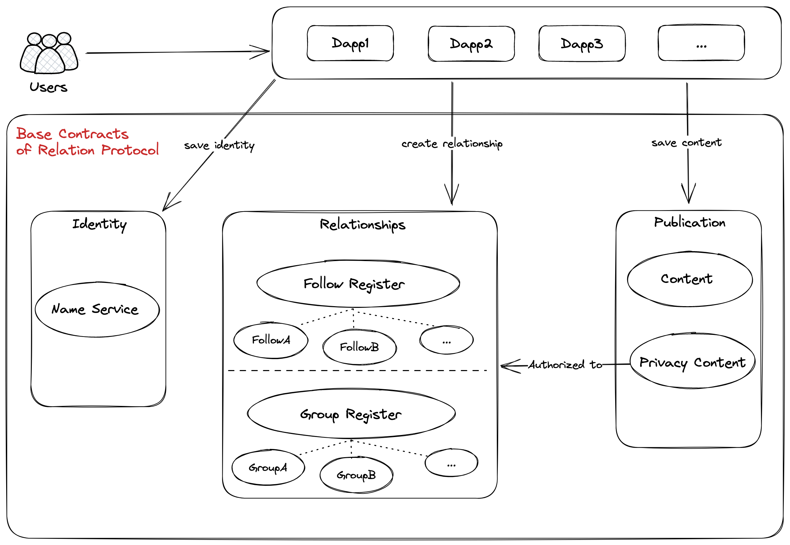

# Semantic Soulbound Token

## Setup

### Clone the Repository
```
git clone git@github.com:JessicaChg/semanticSBT.git
cd semanticSBT
```

### Set environment


```shell
# require Node.js 14+
cp .env.example .env
# modify the env variable `*_PrivateKey` to your own private key

```

### Use brownie

#### compile the contracts 

- install the library of this project depends on
```
pip3 install eth-brownie
```
- compile contracts
```
brownie compile
```
- test contracts
```
brownie test
```

#### deploy 

1. deploy to testnet, take the goerli as example

+ add network
```shell
brownie networks list
brownie networks add polygon goerli host=<RPC_URL> chainid=5 explorer=<EXPORE_URL>
```

+ set network_to_cid
```shell
cp metadata/network_to_cid.json.sample metadata/network_to_cid.json
```

+ deploy
```sh
# libraries
brownie run brownie_scripts/libraries/deploy_semanticUpgradeLogic.py --network goerli
brownie run brownie_scripts/libraries/deploy_nameserviceLogic.py  --network goerli 
brownie run brownie_scripts/libraries/deploy_daoregisterLogic.py  --network goerli 
brownie run brownie_scripts/libraries/deploy_followregisterLogic.py  --network goerli 

# upgradeable
brownie run brownie_scripts/upgrade/deploy_proxyadmin.py --network goerli

# social
brownie run brownie_scripts/social/deploy_nameservice.py  --network goerli 
brownie run brownie_scripts/social/deploy_dao_register.py  --network goerli 
brownie run brownie_scripts/social/deploy_follow_register.py  --network goerli 
brownie run brownie_scripts/social/deploy_content.py  --network goerli 

# relation
brownie run brownie_scripts/relation/deploy_relation_profile_nft.py  --network goerli 
```


### use hardhat

#### compile the contracts
- install the library of this project depends on
```
npm install
```
- compile contracts
```
npx hardhat compile
```
- test contracts
```
npx hardhat test
```

#### deploy

1. fill in the parameters in  hardhat.config.js
```
// Replace "INFURA PROJECT ID" with your INFURA project id
// Go to https://infura.io/, sign up, create a new App in its dashboard, and replace "KEY" with its key
const INFURA_PROJECT_ID = "INFURA INFURA PROJECT ID";

// Replace "PRIVATE KEY" with your account private key
// To export your private key from Metamask, open Metamask and go to Account Details > Export Private Key
// Be aware of NEVER putting real Ether into testing accounts
const PRIVATE_KEY = "PRIVATE KEY";
```

2. deploy to local
```sh
npx hardhat node
npx hardhat run scripts/deploy.js

```

3. deploy to testnet, take the goerli as example

+ deploy and verify
```sh
npx hardhat run scripts/deploy.js --network goerli

npx hardhat verify --contract contracts/core/Semantic.sol:Semantic  --network goerli <DEPLOYED_CONTRACT_ADDRESS>
```


## Overview

The Contract Open Standard is a smart contract specification defined by the Relation Protocol. It has two basic requirements:

* The contracts should conform to the data format and interface specification defined by the [Open Standard API](https://docs.relationlabs.ai/protocol/open-standard-api/introduction).
* The RDF data constructed by these contracts should conform to the [Schema Standard](https://docs.relationlabs.ai/protocol/schema-standard/overview).

Relation Protocol defined a set of Base Contracts based on the Contract Open Standard to address the three following scenarios.

**Identity**: Describe users' identity via SBT contracts.

* [Name Service](./contracts/template/NameService.sol)

**Relationships**: Describe connections between different users via SBT contracts.

* [Follow](./contracts/template/Follow.sol)
* [DAO](./contracts/template/Dao.sol)

**Publication**: Describe users' public or privacy content published via SBT contracts.

* [Content](./contracts/template/Content.sol)
* [Privacy Content](./contracts/template/PrivacyContent.sol)


<figure style="float: right; text-align: center;font-style: italic;font-size: smaller;text-indent: 0;margin: 0.5em;padding: 0.5em;">
  <p>
  <figcaption>Base Contracts</figcaption>
</figure>

