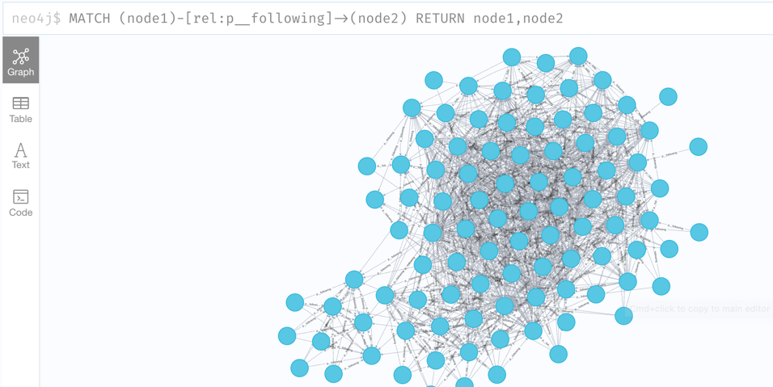

# Construct a social graph with Relation Protocol


We will demonstrate how to quickly build a graph-indexer to listen to on-chain data, store RDF data using neo4j graph database, and query and show a graph.

## Dependencies

Before we start, you should have [Node.js](https://nodejs.org/en/) installed on your computer.

## Deploy neo4j

Please refer to [this document](https://docs.relationlabs.ai/protocol/indexer/build-graph) for neo4j deployment.

## A simple Graph Indexer

We will use nodejs & neo4j-driver to proceed.

> This example will listen to the RDF data in between blocks 8701627 and 8702627 on the Goerli network.

1. Create a new project and install the neo4j-driver and ethers(v5) libraries.

```shell
mkdir graph-indexer
cd graph-indexer
npm init -y
npm install neo4j-driver ethers@5
```

2. Create an app.js to listen to data on the blockchain:

```javascript
const ethers = require('ethers')
const rpc = 'https://rpc.ankr.com/eth_goerli'
let abi = ['event CreateRDF(uint256 indexed tokenId, string rdfStatements)']
const provider = new ethers.providers.JsonRpcProvider(rpc)
const iface = new ethers.utils.Interface(abi)
const filter = {}

// connect neo4j-server
const neo4j = require('neo4j-driver')
const uri = 'bolt://localhost:7687'
// neo4j's default user/password are: neo4j/neo4j
const user = 'neo4j'
const password = 'neo4j'
const driver = neo4j.driver(uri, neo4j.auth.basic(user, password))
const session = driver.session()

// Insert rdf into neo4j
async function insertRdfToNeo4j(rdfString) {
    const session = driver.session()
    try {
        const result = await session.run(
            `CALL n10s.rdf.import.inline("PREFIX : <http://relationlabs.ai/entity/>
    PREFIX p: <http://relationlabs.ai/property/>
    prefix rdf: <http://www.w3.org/1999/02/22-rdf-syntax-ns#>
    prefix xsd: <http://www.w3.org/2001/XMLSchema#>
    prefix rdfs: <http://www.w3.org/2000/01/rdf-schema#>

    ${rdfString}","Turtle");`
        )
        return result
    } catch (error) {}
    session.close()
}

// Listen to new events on the blockchain
provider.on(filter, async (e) => {
  try {
    let event = iface.parseLog(e)
    if (event) {
      const rdf = event.args[1]
      //  Parse
      //  todo: Execute your own business logic. You can filter the RDF data you need.
      //  Insert into the database.
      const res = await insertRdfToNeo4j(rdf)
    }
  } catch (error) {}
})

// You can also specify a filter for data.
const logFilter = {
  fromBlock: 8701627,
  toBlock: 8702627,
  topics: [
        utils.id("CreateRDF(uint256,string)"),
    ]
}
provider
  .getLogs(logFilter)
  .then(function (logs) {
    for (let index = 0; index < logs.length; index++) {
      try {
        const log = logs[index]
        const event = iface.parseLog(log)
        if (event) {
          const rdf = event.args[1]
          insertRdfToNeo4j(rdf)
        }
      } catch (error) {}
    }
  })
  .catch(function (err) {
    console.log(err)
  })

```

3. Run the Graph Indexer

```shell
node app.js
```

Once the data is inserted, open [http://localhost:7474/browser/](http://http://localhost:7474/browser/) in your browser, and input `match (n) return n` in the interface to query all the data.

To query all the "follow" relationship, you can use:
```shell
MATCH (node1)-[rel:p__following]->(node2)
RETURN node1,node2
```
You will see the following graph:

