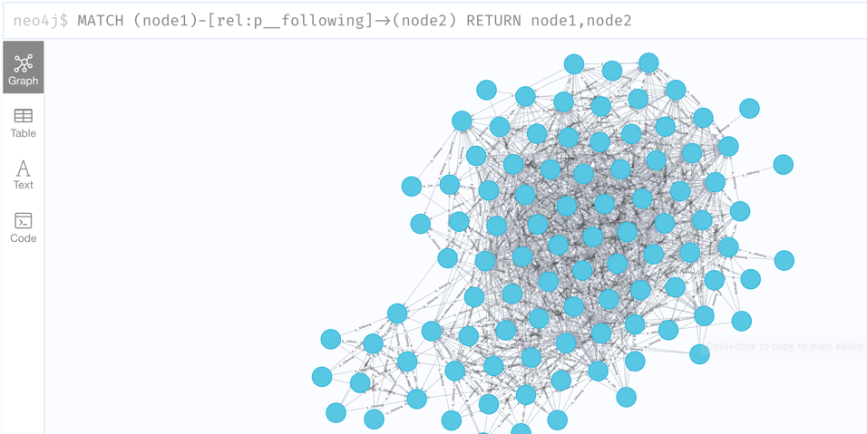

# 构建Relation Protocol社交图谱


这里将介绍如何快速构建一个 graph-indexer监听链上数据,利用neo4j图数据库存储RDF数据、查询并展示图谱。

## 环境依赖

开始本教程之前，您的计算机上必须安装[Node.js](https://nodejs.org/en/)。

## 部署 neo4j

参考[该文档](https://docs.relationlabs.ai/protocol/indexer/build-graph)中的 neo4j 部分

## 一个简单的 Graph Indexer

这里我们使用 nodejs & neo4j-driver 来完成。

> 本示例将会监听 Goerli 网络上 8701627 至 8702627 区块的 RDF 数据。

1. 新建一个项目，安装 neo4j-driver ethers(v5) 库

```shell
mkdir graph-indexer
cd graph-indexer
npm init -y
npm install neo4j-driver ethers@5
```

2. 监听链上数据，创建一个 app.js，内容如下:

```javascript
const ethers = require('ethers')
const rpc = 'https://rpc.ankr.com/eth_goerli'
let abi = ['event CreateRDF(uint256 indexed tokenId, string rdfStatements)']
const provider = new ethers.providers.JsonRpcProvider(rpc)
const iface = new ethers.utils.Interface(abi)
const filter = {}

// connect neo4j-server
const neo4j = require('neo4j-driver')
const uri = 'bolt://localhost:7687'
// neo4j默认的 用户名/密码 为 neo4j/neo4j
const user = 'neo4j'
const password = 'neo4j'
const driver = neo4j.driver(uri, neo4j.auth.basic(user, password))
const session = driver.session()

// 将rdf插入neo4j
async function insertRdfToNeo4j(rdfString) {
    const session = driver.session()
    try {
        const result = await session.run(
            `CALL n10s.rdf.import.inline("PREFIX : <http://relationlabs.ai/entity/>
    PREFIX p: <http://relationlabs.ai/property/>
    prefix rdf: <http://www.w3.org/1999/02/22-rdf-syntax-ns#>
    prefix xsd: <http://www.w3.org/2001/XMLSchema#>
    prefix rdfs: <http://www.w3.org/2000/01/rdf-schema#>
    
    ${rdfString}","Turtle");`
        )
        return result
    } catch (error) {}
    session.close()
}

// 监听链上所有新的事件
provider.on(filter, async (e) => {
  try {
    let event = iface.parseLog(e)
    if (event) {
      const rdf = event.args[1]
      //  解析
      //  todo: 做自己的业务逻辑，可以筛选自己需要的RDF数据
      //  入库
      const res = await insertRdfToNeo4j(rdf)
    }
  } catch (error) {}
})

// 也可以获取指定filter的数据
const logFilter = {
  fromBlock: 8701627,
  toBlock: 8702627, 
  topics: [
        utils.id("CreateRDF(uint256,string)"),
    ]
}
provider
  .getLogs(logFilter)
  .then(function (logs) {
    for (let index = 0; index < logs.length; index++) {
      try {
        const log = logs[index]
        const event = iface.parseLog(log)
        if (event) {
          const rdf = event.args[1]
          insertRdfToNeo4j(rdf)
        }
      } catch (error) {}
    }
  })
  .catch(function (err) {
    console.log(err)
  })

```

3. 运行 Graph Indexer 程序

```shell
node app.js
```

等待数据插入后，在浏览器打开[http://localhost:7474/browser/](http://http://localhost:7474/browser/)，输入框中输入`match (n) return n`即可查询到所有数据

如果需要查询所有follow关系，可以输入
```shell
MATCH (node1)-[rel:p__following]->(node2)
RETURN node1,node2
```
将看到以下图谱：
